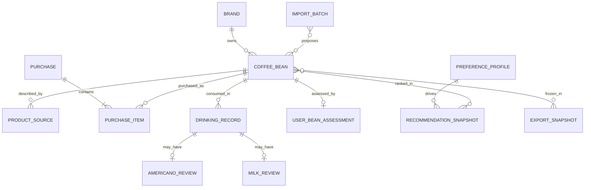
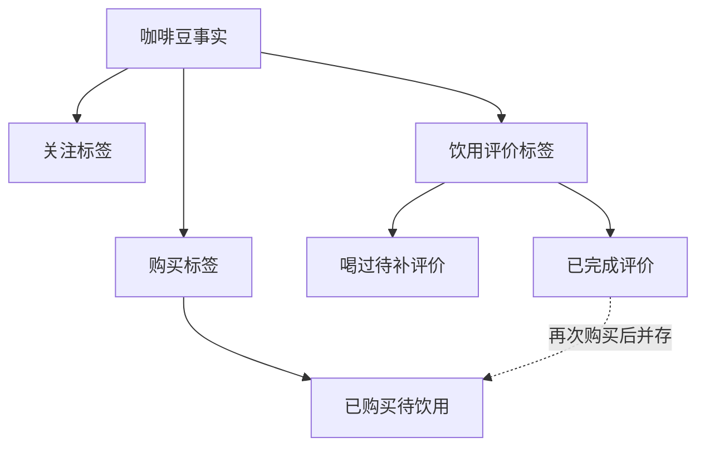
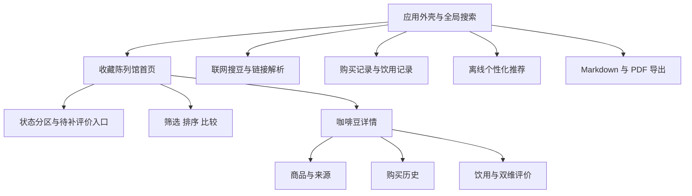
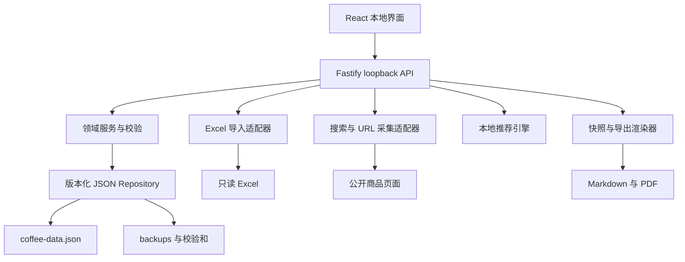
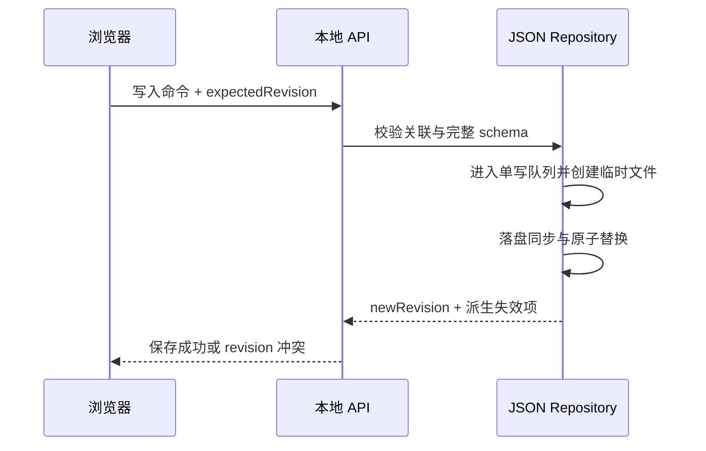
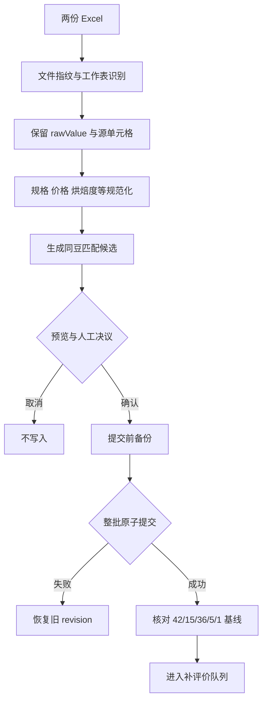
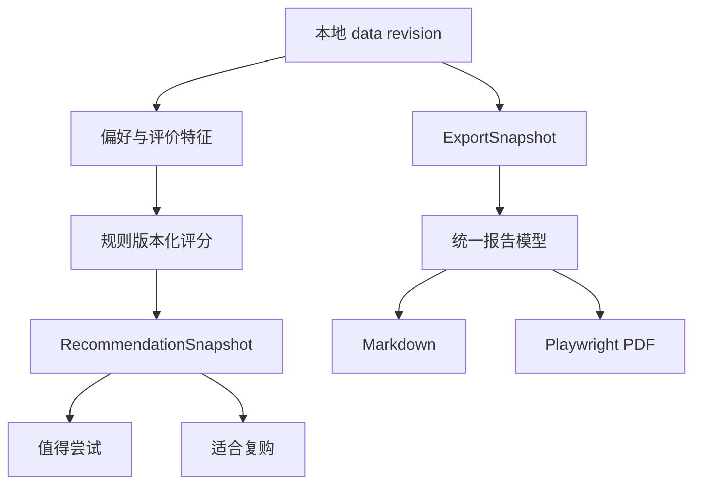

# 咖啡豆个人看板 - Plan

## Goal Capsule

- **Objective:** 建设一个永久单用户、本地运行的咖啡豆个人看板，先迁移 2026 年 4 月 Excel 数据并补录此后喝过但尚未评价的咖啡豆，再形成可持续的关注、购买、饮用、评价和导出闭环。
- **Product authority:** 本文定义首版产品行为、长期产品边界和验收信号；`AGENTS.md` 定义开发代理必须遵守的工程约束。
- **Primary user:** 小孟，唯一使用者和个人评价的最终权威。
- **Execution profile:** 从数据模型、迁移和补评价纵向切片开始，再完成日常记录、陈列馆、推荐、联网采集和同快照导出。
- **Stop conditions:** 任何实现不得覆盖原始 Excel、静默丢失关联记录、把缺失评价当作低分，或让首版推荐依赖联网服务。
- **Tail ownership:** 实施者负责代码、迁移夹具、自动化测试、浏览器验收、PDF 视觉验收和本地启动说明；计划中无启动阻断问题。

---

## Product Contract

### Summary

建设一个以“收藏陈列馆”为主入口的本地咖啡豆管理应用，融合选豆决策、商品采集、购买记录、饮用记录和个人评价。
首版首先解决 2026 年 4 月以后多款已饮用咖啡豆尚未记录评价的问题，并让之后的购买与饮用不再散落。

### Problem Frame

现有知识库已在两份 Excel 中积累 42 款咖啡豆、15 个品牌、推荐等级、参考价格、适用场景和 5 款已喝评价，但数据停留在 2026 年 4 月版本附近。
此后实际喝过的多款咖啡豆尚未进入个人评价体系，购买事实、饮用过程和最终评价缺少连续关联。

当前表格适合批量整理，却不适合在日常使用中快速补录、持续更新和回看。
如果不建立低摩擦的记录闭环，新增体验仍会继续散落，价格监控和个性化推荐也缺乏可信的个人数据基础。

### Actors

- A1. **使用者:** 浏览、采集、确认、编辑、记录、评价和导出数据的唯一人类用户。
- A2. **本地应用:** 维护本地数据、派生状态、呈现看板并生成导出文件。
- A3. **外部商品来源:** 在用户主动搜索或解析商品链接时提供候选商品信息，不具有直接写入本地知识库的权限。

### Key Decisions

- **先补历史评价，再扩展高级能力。** (session-settled: user-directed — chosen over treating visual browsing as the first milestone: several coffees consumed since April still lack personal reviews.) Governs R1, R2, R3, R4.
- **收藏陈列馆作为主框架。** (session-settled: user-approved — chosen over a decision-only cockpit or journal-only homepage: browsing remains the durable entry point while decision and journal capabilities stay accessible.) Governs R5, R6, R7.
- **购买记录与饮用记录分离。** (session-settled: user-directed — chosen over one combined timeline: one purchase may contain several beans while one drinking record concerns one bean.) Governs R8, R9, R10, R11, R12, R13, R14, R15.
- **联网采集采用链接与关键词双入口。** (session-settled: user-directed — chosen over supporting only one intake method: both known product pages and exploratory discovery are common.) Governs R16, R17, R18, R19.
- **永久单用户、本地优先。** (session-settled: user-directed — chosen over hosted or Obsidian-embedded operation: this is a private personal tool and must not grow account or collaboration concerns.) Governs R23, R24, R25, R26.
- **导出 Markdown 与 PDF。** (session-settled: user-directed — chosen over Excel export: Obsidian archiving and readable sharing are the required outcomes.) Governs R27, R28, R29, R30.

### Requirements

**历史迁移与补评价**

- R1. 首次使用必须能够导入 `意式咖啡豆_完整版.xlsx` 和 `意式咖啡豆_选单.xlsx` 中的现有咖啡豆、品牌、价格、状态、推荐等级和个人评价。
- R2. 导入过程必须在写入前展示识别结果、重复项、冲突项和无法识别的字段，并允许用户确认或修正。
- R3. 系统必须提供“喝过但待补评价”队列，使用户能连续补录 2026 年 4 月以后尚未登记的咖啡豆，而不必重复完整的商品采集流程。
- R4. 补评价流程必须支持先用最少信息建立咖啡豆和饮用事实，再于之后补齐商品资料或详细评价。

**收藏陈列馆与详情**

- R5. 首页必须以咖啡豆陈列馆呈现全部条目，并清晰区分已关注、已购买待饮用、喝过待补评价和已完成评价。
- R6. 用户必须能够按品牌、烘焙度、价格、风味、处理法、适用场景、状态和个人等级进行搜索、筛选和排序。
- R7. 咖啡豆详情必须汇总基本商品信息、来源与价格、购买记录、饮用记录、美式评价、奶咖评价和综合结论。

**购买记录**

- R8. 一次购买记录必须支持包含一支或多支咖啡豆，并保留购买日期、渠道、订单备注和各商品的规格、数量及实际价格。
- R9. 同一咖啡豆必须允许出现多次购买，以保留复购和价格变化历史。
- R10. 创建购买记录后，相关咖啡豆必须显示“已购买待饮用”，但不得自动生成饮用事实；已有饮用和评价状态必须同时保留。

**饮用与个人评价**

- R11. 一次饮用记录只能关联一支咖啡豆，并允许同一咖啡豆产生多次饮用记录。
- R12. 饮用记录必须支持日期、冲煮方式、萃取备注和自由文本感受；冲煮方式至少覆盖美式与奶咖。
- R13. 美式与奶咖必须是彼此独立的评价维度，每个维度可标记为未评价、已评价或不适用；允许只评价其中一种，也允许之后补评另一种。
- R14. 个人评价必须能够表达评分、风味感受、优缺点、是否回购和综合等级；具体评分量表在实施规划中确定。
- R15. 当咖啡豆已有饮用事实，但用户计划评价的维度仍不完整时，系统必须显示“喝过待补评价”；不适用维度不阻塞完成，任何缺失评价不得被解释为低分。

**联网发现与采集**

- R16. 用户必须能够粘贴商品链接并请求解析，也能够输入品牌或咖啡豆名称搜索候选商品。
- R17. 联网采集结果必须先进入预览状态，展示字段值、来源链接和采集时间；只有用户确认后才能保存。
- R18. 用户必须能够修改采集结果、选择性接受字段，并在解析失败时保留来源链接后手工补齐。
- R19. 系统不得以网络搜索结果覆盖已有个人评价、购买记录或用户手工确认的数据。

**选豆决策**

- R20. 应用必须提供基于现有字段的比较视图，用于观察价格、烘焙度、甜感、酸感、风味强度及美式或奶咖适配性。
- R21. 用户必须能够从筛选或比较结果进入咖啡豆详情、加入关注或创建购买记录。
- R22. 首版必须基于本地保存的咖啡豆资料、购买记录、饮用记录、个人评价和用户维护的本地偏好生成个性化推荐，并说明主要推荐依据；推荐可随本地数据变化或由用户手动刷新，但不得依赖联网实时更新。

**本地数据与隐私**

- R23. 应用必须作为本地独立网页应用运行，核心数据默认保存在咖啡豆项目目录控制的本地存储中。
- R24. 除用户主动发起商品搜索或链接解析外，应用不得向外部服务发送咖啡豆收藏、购买记录、饮用记录或个人评价。
- R25. 原始 Excel 文件必须作为迁移输入保留；导入、编辑和导出不得静默覆盖原文件。
- R26. 本地数据必须支持可恢复备份，任何结构升级都必须避免不可逆地损坏已有记录。

**导出**

- R27. 用户必须能够将当前筛选范围或指定咖啡豆导出为 Markdown 评价报告。
- R28. 用户必须能够将与 Markdown 同一数据版本的评价报告导出为 PDF。
- R29. 导出内容必须包含生成时间、数据版本或快照标识、咖啡豆基本信息、个人评价及当前筛选条件。
- R30. Markdown 报告必须适合直接保存到 Obsidian；PDF 必须适合阅读、打印和分享。

**体验与视觉**

- R31. 页面必须开放、活泼、美观并具有明确的咖啡主题，但不得依赖大面积棕色、拟物咖啡杯或模板化卡片堆砌来表达主题。
- R32. 桌面端必须优先保证高密度信息仍可快速扫描，同时在窄屏浏览器中保持主要查看和录入流程可用。
- R33. 补评价、添加购买和记录饮用必须是首页可快速到达的高频操作。
- R34. 空状态、导入冲突、联网失败、保存成功和未完成评价必须提供清晰反馈。
- R35. 交互必须达到 WCAG 2.2 AA 的适用要求，至少覆盖键盘访问、语义结构、可见焦点、对比度、表单标签与错误关联、异步状态播报、对话框焦点约束、足够触控目标和减少动态效果偏好。

**更正、归档与恢复**

- R36. 用户必须能够更正购买、饮用和评价记录；存在关联历史的咖啡豆只能归档，只有没有任何引用的空白或最小草稿豆才能在明确确认后永久删除，任何操作不得静默级联丢失记录。

### Information Model



该结构表达三项不可混淆的事实：商品资料描述“它是什么”，购买记录描述“何时买了什么”，饮用记录和评价描述“何时喝了以及感受如何”。

### State Model



展示状态由事实派生，并允许多个标签同时存在。已完成评价的咖啡豆再次购买后，可以同时显示“已完成评价”和“已购买待饮用”；新饮用记录评价不完整时，同时显示“喝过待补评价”。

### Key Flows

- F1. **历史数据迁移与补评价**
  - **Trigger:** 用户首次打开应用或主动进入迁移工具。
  - **Actors:** A1, A2。
  - **Steps:** 选择现有 Excel；预览识别与冲突；确认导入；查看待补评价队列；快速补建咖啡豆或饮用事实；逐项完成评价。
  - **Outcome:** 4 月版数据完整进入本地应用，之后喝过的咖啡豆被补录并可继续维护。
  - **Covers:** R1, R2, R3, R4, R25。

- F2. **联网搜索并加入关注**
  - **Trigger:** 用户输入关键词或商品链接。
  - **Actors:** A1, A2, A3。
  - **Steps:** 发起搜索或解析；展示候选与字段来源；用户选择并修改；确认保存。
  - **Outcome:** 新咖啡豆以可核验资料进入已关注列表，失败时仍能手工完成。
  - **Covers:** R16, R17, R18, R19。

- F3. **记录一次多商品购买**
  - **Trigger:** 用户完成一笔包含一支或多支咖啡豆的购买。
  - **Actors:** A1, A2。
  - **Steps:** 创建购买记录；添加多个商品行；填写实际规格、数量和价格；确认保存。
  - **Outcome:** 一笔订单关联多个咖啡豆，各咖啡豆进入已购买待饮用状态。
  - **Covers:** R8, R9, R10。

- F4. **记录一次饮用并评价**
  - **Trigger:** 用户饮用一支咖啡豆或补记历史体验。
  - **Actors:** A1, A2。
  - **Steps:** 选择单支咖啡豆；记录饮用日期与冲煮方式；填写对应评价；可保存不完整草稿并稍后补齐。
  - **Outcome:** 饮用事实独立保存，咖啡豆状态按评价完整度更新。
  - **Covers:** R11, R12, R13, R14, R15。

- F5. **筛选并导出评价快照**
  - **Trigger:** 用户完成筛选或打开指定咖啡豆后选择导出。
  - **Actors:** A1, A2。
  - **Steps:** 确认导出范围；生成同一快照；选择 Markdown 或 PDF；保存到本地。
  - **Outcome:** 两种格式表达同一版本的评价结果，并保留生成上下文。
  - **Covers:** R27, R28, R29, R30。

- F6. **离线生成个性化推荐**
  - **Trigger:** 用户进入推荐视图、本地数据变更后进入该视图，或主动刷新。
  - **Actors:** A1, A2。
  - **Steps:** 读取本地偏好、购买和评价；生成“值得尝试”与“适合复购”候选；展示主要依据和数据缺口；进入比较或详情。
  - **Outcome:** 推荐与数据版本和规则版本一起保存，断网时仍可重算。
  - **Covers:** R20, R21, R22, R23, R24。

- F7. **更正、归档与恢复**
  - **Trigger:** 用户更正错误记录、处理被引用豆，或启动时发现主数据损坏。
  - **Actors:** A1, A2。
  - **Steps:** 展示关联影响；更正、归档或确认软删除；重算派生数据；必要时从校验通过的备份恢复。
  - **Outcome:** 事实链保持可解释，损坏或误操作不会静默扩大。
  - **Covers:** R26, R34, R36。

### Page Composition



首页以陈列馆承担长期浏览，待补评价入口在首版必须获得高优先级；购买记录与饮用记录在日志区域分开呈现，并在咖啡豆详情中汇合。

### Acceptance Examples

- AE1. **Covers R1, R2, R25.** 给定两份原始 Excel，当用户执行首次导入时，系统展示将新增、合并、冲突和忽略的项目；用户确认后写入本地数据，原始 Excel 文件内容不变。
- AE2. **Covers R3, R4, R15.** 给定用户自 4 月后喝过一支表格中没有的咖啡豆，当用户只填写品牌、豆名和饮用事实时，该豆进入“喝过待补评价”，之后可继续补充商品信息和美式或奶咖评价。
- AE3. **Covers R8, R10, R11.** 给定一笔同时购买三支豆的订单，当用户保存购买记录时，系统生成一笔购买和三个商品项；三支豆均为“已购买待饮用”，且没有自动生成饮用记录。
- AE4. **Covers R11, R13, R15.** 给定用户只完成某支豆的奶咖评价，当用户保存饮用记录时，奶咖评价可立即展示，美式维度保持未评价而非零分，整体状态为“喝过待补评价”。
- AE5. **Covers R16, R17, R18.** 给定一个可解析的商品链接，当系统返回商品字段时，用户可逐项修改并确认后保存；取消确认不会创建咖啡豆。
- AE6. **Covers R18.** 给定商品页面无法解析，当搜索失败时，用户仍可保存来源链接、手工填写最少信息并加入关注。
- AE7. **Covers R19.** 给定已有个人评价的咖啡豆，当再次解析商品链接时，新采集字段不得覆盖个人评分、饮用记录或手工确认字段。
- AE8. **Covers R27, R28, R29.** 给定用户筛选“已喝过且中深烘焙”，当分别导出 Markdown 与 PDF 时，两份报告包含相同咖啡豆集合、生成时间和快照标识。
- AE9. **Covers R23, R24.** 给定用户只浏览、编辑或导出本地数据，当没有主动执行联网采集时，应用不发送任何个人记录到外部服务。
- AE10. **Covers R22, R23, R24.** 给定用户已有本地偏好、购买和饮用评价，当用户离线打开推荐视图时，系统能根据本地数据给出个性化候选及推荐依据；断网不会阻止推荐刷新。
- AE11. **Covers R10, R15.** 给定一支已完成评价的咖啡豆再次被购买，当购买保存后，该豆同时显示“已完成评价”和“已购买待饮用”，历史评价保持不变。
- AE12. **Covers R2, R26.** 给定两份 Excel 中存在格式差异和实质字段冲突，当用户导入时，格式等价值自动合并，实质冲突等待确认；取消或提交失败不会写入半批数据。
- AE13. **Covers R36.** 给定咖啡豆已有购买或饮用记录，当用户请求删除时，系统展示关联影响并只提供归档；没有引用的最小草稿豆才允许在明确确认后永久删除。
- AE14. **Covers R13, R15.** 给定用户只计划把某支豆用于奶咖，当奶咖评价完成且美式被明确标为不适用时，该豆可显示评价完成；美式不产生零分。

### Success Criteria

- 用户能够将 2026 年 4 月 Excel 数据无损迁入，并在首版使用初期完成此后已喝咖啡豆的补录与个人评价。
- 新增一笔多商品购买、一次单豆饮用和一条评价都能在清晰入口中完成，不再依赖另一个临时表格或散落笔记。
- 任一咖啡豆的商品资料、历次购买、历次饮用、美式评价和奶咖评价均能从详情页追溯。
- 用户能够通过关键词或链接添加商品；自动采集失败时仍能完成手工添加。
- 用户能够在离线状态下获得基于本地购买、饮用和评价数据的个性化推荐，并理解主要推荐依据。
- Markdown 与 PDF 导出能稳定表达同一筛选快照，Markdown 可直接进入 Obsidian。
- 离线浏览、编辑、记录和导出不依赖互联网，也不需要账号。

### Scope Boundaries

**Deferred for later**

- 价格监控、价格历史可视化和价格变化提醒。
- 更高级的趋势分析、口味画像和自动生成年度回顾。

**Outside this product's identity**

- 在线账号和用户体系。
- 多用户协作与共享编辑。
- 云端同步或云端托管个人数据。
- 移动端原生应用。
- 自动下单或代替用户完成购买。

### Dependencies and Assumptions

- 两份 Excel 是历史迁移输入，但字段存在表现层文本、重复信息和可能的口径差异，迁移必须允许人工校正。
- `summary.md` 中的 42 款、15 个品牌和 5 款已喝记录用于核对迁移基线；实际导入还必须核对 36 款未喝、5 款已喝和 1 款在喝，不替代逐行验证。
- 外部商品页面可能存在登录、动态渲染、反爬或字段缺失，因此联网采集按“尽力而为并人工确认”设计。
- 个人评价是用户主观判断；官方描述、公开信息和个人体验必须在界面和导出中区分来源。
- 首版个性化推荐只能消费本地已保存的数据，不得反向改变永久单用户、本地优先的产品身份。

### Sources and Research

- 本地私有摘要：用于核对知识库规模、推荐等级、个人偏好和更新记录，不纳入公开仓库。
- 本地私有工作簿：用于迁移商品详情、价格、状态、个人等级与购买计划，不纳入公开仓库。
- 可选的本地参考看板：仅供交互模式参考，不构成视觉复制要求，也不纳入公开仓库。

---

## Planning Contract

本节只定义实现方式，不改变 Product Contract 中 R1–R36 的产品含义。发生冲突时，产品行为以对应 R-ID 为准，技术机制以对应 KTD-ID 为准。

### Key Technical Decisions

- KTD1. **采用单包 TypeScript 本地 Web 应用。** `./app/` 使用 Node.js 24 LTS、React 19.2、Vite 8 和 Fastify 5。Fastify 只监听 `127.0.0.1`，严格校验 `Host` 与 `Origin`，默认禁用 CORS，并要求所有写请求携带启动时生成的同源 CSRF 令牌和 JSON content type。开发期由 Vite 代理 `/api`，生产启动由 Fastify同时提供静态前端与本地 API。选择该形态是为了可靠读写本地文件、解析 Excel、生成 PDF，并保持单命令启动。
- KTD2. **使用版本化 JSON 文档作为主数据，并明确 Windows 提交协议。** 主文件位于 `./data/coffee-data.json`。数据规模按数百款豆和数千条记录设计，不引入数据库服务。每次写入校验完整 schema，核对 `expectedRevision` 并进入单写队列。提交顺序固定为：在主文件同目录创建唯一临时文件；写入完整序列化字节；执行 `FileHandle.sync()`；关闭句柄；在不预删主文件的前提下替换；重新打开并核对 revision 与校验和。替换失败时保留旧主文件并隔离临时文件。启动时按主文件、临时文件和备份的校验结果进入正常、完成恢复、隔离临时文件或只读恢复状态。该方案只支持应用可获得独占写权限的本地 NTFS/ReFS 目录，不宣称网络盘语义。批量导入和 schema 升级前创建带校验和的备份；未知更高 schema 只读打开，不得以空数据覆盖。
- KTD3. **领域事实、来源和派生结果分层。** `CoffeeBean`、`Purchase`、`PurchaseItem`、`DrinkingRecord`、两类评价和用户填写的 `UserBeanAssessment` 是事实层；`ProductSource` 和 `FieldProvenance` 记录原始值、规范化值、文件/工作表/单元格或 URL；状态、单位价格、比较指标、推荐和界面摘要是可重建派生层。稳定 ID 使用 UUID，名称规范化键只用于查重候选。
- KTD4. **迁移采用可重复的预览批次。** ExcelJS 只读取两份工作簿的主表作为豆记录来源，次级工作表只作字段补充和核对。每个源单元格保存 typed value、displayed text、number format、文件哈希、工作表和单元格地址；规范化使用 typed value 与明确的小数容差，用户预览和审计使用 displayed text。解析结果先做类型规范化，再按字段语义区分等价格式差异与真实冲突。预览保存文件 SHA-256、匹配候选和用户决议；正式提交整批成功或整批回滚。相同批次重复提交保持幂等。
- KTD5. **新评价使用 5 分制，历史评价不强行换算。** 美式和奶咖各自支持 `1.0–5.0`、`0.5` 步进、风味标签、自由文本、优点和缺点。每个维度有“未评价、已评价、不适用”三态。`UserBeanAssessment` 保存用户填写的综合等级与“会回购/看价格/不会回购”，不得由系统重算覆盖。Excel 中的 `A+`、`B+~A-` 等值保存为 `legacyPersonalScoreRaw`，用户确认前不映射成新分数。
- KTD6. **首版推荐是本地、确定性、可解释的内容排序。** 推荐分为“值得尝试”和“适合复购”。候选使用本地 `PreferenceProfile`、美式/奶咖评分、回购判断、风味相似度、烘焙度、价格与关注/购买弱信号。初始权重写入版本化配置：显式评价与回购 45%、冲煮适配 20%、风味相似 20%、价格适配 10%、关注和购买 5%；历史编辑推荐只用于冷启动同分排序。每条理由列出贡献最大的三个因素和数据缺口。`RecommendationSnapshot` 保存数据 revision、规则版本和生成时间；revision 变化后标记过期，进入推荐页或手动操作时离线重算。
- KTD7. **联网采集采用隔离适配器和人工确认门。** 关键词搜索的首个 best-effort provider 适配 DuckDuckGo 非 JavaScript HTML 结果页，仅发送查询词；发布门要求实时契约探针能返回候选，否则必须修复或替换适配器，不能只依赖旧夹具宣布 R16 完成。provider 不可用时显示统一停用状态并保留查询；直接 URL 与手工录入是稳定回退。URL 解析先处理 JSON-LD、Open Graph 和静态 HTML，再进入来源专用适配器。所有候选先查重并让用户选择“合并到已有豆、创建新豆或取消”。只允许 `http/https`，拒绝凭据 URL、回环/私网/链路本地地址和危险端口。受控 DNS lookup 必须拒绝任一非公网 A/AAAA 或 IPv4-mapped IPv6 结果，并把已批准 IP 固定到实际 socket；重定向逐跳重复该流程，忽略代理环境变量，并限制响应大小、内容类型和总超时。页面受限或结构变化时保留关键词/URL并转手工录入，不绕过验证码或登录。
- KTD8. **Markdown 与 PDF 共用不可变导出快照。** 导出先把筛选条件、排序、豆集合、报告模型和数据 revision 固化为 `ExportSnapshot`。所有文本按 Markdown 或 HTML 上下文转义，URL 只允许安全 scheme。Markdown 渲染器输出纯 Markdown；PDF 渲染器把同一报告模型生成带严格 CSP 的本地 HTML，再由已固定版本的 Playwright Chromium 按 A4 print CSS 输出，并拦截除打包字体和本地样式外的全部网络与文件请求。生成前等待 `document.fonts.ready`，PDF 开启 tagged 与 outline，测试同时检查结构标签、元数据和逐页视觉结果。一次任务可选一种或两种格式；单格式失败后复用同一快照重试，临时文件只在成功后改为正式文件。
- KTD9. **界面采用领域化设计系统和统一异步状态契约。** 设计令牌、排版、状态语义和动效集中在 `src/styles/`。陈列馆使用编辑感网格、错落的信息节奏、暖奶油底色、莓果红与青绿色功能色，并以风味谱、产地线条和纸张层次表达咖啡主题。导入、采集、推荐刷新和导出共享 initial/loading/empty/partial/success/error/cancelled/stale 状态语义，统一防重复提交、保留输入、重试动作和 `aria-live` 播报。可参考本地看板的搜索筛选、卡片/列表、详情抽屉、焦点恢复和减少动态效果模式，但不复用其内嵌 JSON 架构。
- KTD10. **更正优先，删除保守。** 饮用记录可选关联 `PurchaseItem`；首版只维护购买项的“未知、未开封、饮用中、已用完”包级状态，不按克数扣库存。被事实引用的咖啡豆只能归档。购买或饮用记录移入回收站前展示关联影响，保存后提供立即撤销；回收站支持恢复与明确永久清除，恢复冲突必须先解决。每次操作统一重算派生状态并使推荐过期；历史 `ExportSnapshot` 永不反向修改。

### High-Level Technical Design









### Data and API Boundaries

- 浏览器只通过 `/api` 访问数据，不直接把业务事实放入 `localStorage`。`localStorage` 只允许保存无损的界面偏好，例如列表/网格模式和折叠状态。
- 本地 API 只接受受信 `Host`、同源 `Origin`、JSON 写请求和有效 CSRF 令牌；恢复、采集、导出和删除接口与普通写接口使用相同保护。
- 所有写 API 接收 `expectedRevision`。过期写入返回 `409`，界面要求刷新并保留用户未提交输入。
- 多实体操作必须是单次命令：购买与所有购买项一起保存；饮用事实与当次评价一起保存；导入批次一起提交。
- 日期型事实使用本地日历日期 `YYYY-MM-DD`；机器事件使用带时区的 ISO 8601。未知值保存为 `null`，不得用 `0` 或空字符串代替。
- 金额保存 `{amount, currency}`，首版默认 `CNY`；购买项保存规格克数、数量和行实付金额，单位价只作为派生值。订单优惠和运费为可选字段，不完整时不参与单位价推断。
- 草稿仅用于多行购买和饮用/评价长表单。草稿不进入统计、推荐和导出，并在首页单独提示。
- 默认日志不得记录请求体、评价文本、查询串、完整 URL、认证头、Cookie 或本地绝对路径。错误日志使用字段化错误码和脱敏标识，日志、临时导出、备份和回收站的保留位置与清理规则写入 README。
- Excel、HTML、JSON-LD、用户文本和外部 URL 都是不可信输入。解析器必须限制大小与长度，不执行公式、宏、外部链接、脚本或子资源；展示和导出必须进行上下文转义。

### Output Structure

```text
./
├── AGENTS.md
├── 咖啡豆看板-产品需求文档.md
├── app/
│   ├── package.json
│   ├── package-lock.json
│   ├── tsconfig.json
│   ├── vite.config.ts
│   ├── playwright.config.ts
│   ├── src/
│   │   ├── client/
│   │   ├── server/
│   │   ├── domain/
│   │   ├── storage/
│   │   ├── import/xlsx/
│   │   ├── collectors/
│   │   ├── recommendation/
│   │   ├── exports/
│   │   ├── styles/
│   │   └── assets/fonts/
│   └── tests/
│       ├── unit/
│       ├── integration/
│       ├── e2e/
│       └── fixtures/
├── data/
│   ├── coffee-data.json
│   └── backups/
└── exports/
```

`data/`、`exports/`、临时文件和浏览器测试产物由 `./.gitignore` 排除；代表性匿名化迁移夹具和测试快照保留在 `app/tests/fixtures/`。不得修改仓库根 `.gitignore` 中用户现有内容。

### Sequencing and Vertical Slices

1. 先完成 U1 的运行骨架、领域 schema、revision 写入和恢复页。
2. U2 把真实 Excel 安全迁入，并用真实基线与冲突样例锁定迁移质量。
3. U3 立即交付最关键的补评价队列，使用户可以开始清理 4 月后的漏记。
4. U4 与 U5 完成持续记录闭环和长期浏览框架。
5. U6 使用已有本地数据交付个性化推荐，不等待联网采集。
6. U7 与 U8 分别补齐外部采集和可归档导出。
7. U9 统一完成浏览器、可访问性、恢复、打包和视觉验收。

### System-Wide Impact

- **数据生命周期：** 主数据从 Excel 快照转为可持续修改的 JSON 文档；Excel 保持只读历史输入。
- **派生一致性：** 状态、推荐、比较指标和导出都依赖同一 data revision；任何事实修改必须统一失效和重算。
- **隐私边界：** 本地记录只进入 loopback 服务；联网适配器只接收用户主动提供的查询词或 URL。
- **长期维护：** 数据 schema 和推荐规则均版本化；第三方网页变化只影响单个 collector，不影响核心记录。
- **仓库影响：** 新增独立 `app/`，不改造 Obsidian 配置，也不把现有单文件工作看板变成共享运行时依赖。

### Risks and Mitigations

| Risk | Impact | Mitigation | Proof |
|---|---|---|---|
| Excel 展示文本与字段冲突 | 误合并或丢失历史语义 | raw/provenance 双存、规范化后分类、人工预览、整批回滚 | U2 夹具与基线测试 |
| JSON 写入中断或多标签页覆盖 | 主数据损坏或编辑丢失 | revision 乐观锁、单写队列、原子替换、校验和备份、只读恢复 | U1 故障注入测试 |
| 公共搜索页面结构变化 | 关键词搜索失效 | provider 接口、契约夹具、超时提示、保留查询并手工回退 | U7 collector 契约测试 |
| 任意 URL 带来 SSRF | 访问本机或局域网资源 | 协议/地址/端口验证、DNS 结果检查、逐跳重定向校验、大小与时间限制 | U7 安全测试 |
| 早期评价样本少 | 推荐显得武断 | 显式偏好、弱信号降权、置信提示、理由与数据缺口、规则版本 | U6 冷启动测试 |
| PDF 字体或分页差异 | 中文乱码、截断或两格式不一致 | 固定 Noto Sans SC 字体、统一报告模型、print CSS、逐页截图验收 | U8 PDF 视觉测试 |

### External Research

- Node.js 发布策略与 LTS 状态：`https://nodejs.org/en/about/previous-releases`
- Vite 8 与 Node 版本要求：`https://vite.dev/blog/announcing-vite8`
- React 当前版本：`https://react.dev/versions`
- Fastify v5 校验与序列化：`https://fastify.dev/docs/latest/Reference/Validation-and-Serialization/`
- ExcelJS 读取 XLSX：`https://github.com/exceljs/exceljs`
- Playwright `page.pdf()`：`https://playwright.dev/docs/api/class-page#page-pdf`
- Vitest 使用要求：`https://vitest.dev/guide/`
- OWASP SSRF 防护：`https://cheatsheetseries.owasp.org/cheatsheets/Server_Side_Request_Forgery_Prevention_Cheat_Sheet.html`

---

## Implementation Units

本节的 `Verification` 命令默认在 `./app/` 内执行；`Verification Contract` 表格提供从仓库根执行的等价命令。

### U1. 本地应用骨架、领域 schema 与安全存储

- **Goal:** 建立可启动、可校验、可原子写入和可恢复的本地应用底座。
- **Requirements:** R23, R24, R26, R31, R32, R34, R35, R36；KTD1, KTD2, KTD3, KTD9, KTD10。
- **Dependencies:** 无。
- **Files:** `./app/package.json`, `./app/package-lock.json`, `./app/index.html`, `./app/tsconfig.json`, `./app/tsconfig.client.json`, `./app/tsconfig.server.json`, `./app/vite.config.ts`, `./app/src/client/main.tsx`, `./app/src/client/App.tsx`, `./app/src/server/start.ts`, `./app/src/server/app.ts`, `./app/src/server/local-security.ts`, `./app/src/domain/schema.ts`, `./app/src/domain/status.ts`, `./app/src/storage/json-repository.ts`, `./app/src/storage/backup-service.ts`, `./app/src/storage/migrations/index.ts`, `./app/src/styles/tokens.css`, `./.gitignore`。
- **Approach:** 创建 TypeScript 严格模式工程、共享 schema、完整 package scripts 和可执行的前后端入口。实现空库初始化、schemaVersion/dataRevision、版本迁移注册表、未知 schema 只读策略、单写队列、expectedRevision、KTD2 Windows 提交协议、备份清单和只读恢复页。后续单元新增持久化字段时，必须在同一单元同时提交迁移和旧版本夹具。先提供 `/api/health`、`/api/snapshot`、`/api/recovery` 与最小应用外壳，并用统一 middleware 实施 KTD1 的本地 API 保护。提供 `npm run setup` 和 `npm run doctor`，安装并验证与锁定版本匹配的 Playwright Chromium。
- **Test Scenarios:** 首次启动创建空库；合法写入 revision 加一；旧 revision 返回 409；崩溃发生在 sync/close/replace 前后；目标文件被锁定或返回 access denied；孤立临时文件；损坏 JSON 进入只读模式；未知更高 schema 只读打开；备份校验失败不可恢复；服务只监听 loopback并同时提供 UI 与 `/api/health`；恶意 Host、跨源 Origin、缺失/错误 CSRF 和非 JSON 写请求被拒绝；doctor 能发现缺失或版本不匹配的 Chromium并给出修复动作。
- **Verification:** `npm run test:unit -- storage status`, `npm run test:integration -- repository`, `npm run typecheck`, `npm run build`。

### U2. Excel 迁移、规范化、冲突预览与提交

- **Goal:** 无损导入两份历史工作簿，并把真实冲突交给用户而不是静默猜测。
- **Requirements:** R1, R2, R25, R26；AE1, AE12；KTD3, KTD4。
- **Dependencies:** U1。
- **Files:** `./app/src/import/xlsx/workbook-reader.ts`, `./app/src/import/xlsx/field-map.ts`, `./app/src/import/xlsx/normalizers.ts`, `./app/src/import/xlsx/matcher.ts`, `./app/src/import/xlsx/preview-service.ts`, `./app/src/import/xlsx/commit-service.ts`, `./app/src/server/routes/import.ts`, `./app/src/client/features/import/ImportWizard.tsx`, `./app/tests/fixtures/import/`, `./app/tests/integration/import.test.ts`。
- **Approach:** 主记录只读取 `产品详情对比` 与 `选豆决策表`。保留所有源值与单元格定位。预检限制为 25MB 压缩文件、100MB 展开总量、100 个 ZIP entry、20 个工作表、每表 100,000 个非空单元格、单字符串 64KB 和 15 秒解析预算；拒绝宏、外部链接和不需要的公式计算。先归一化 `250/250g`、比例精度、价格字符串和烘焙同义词，再识别真实冲突。把空 `购买计划` 识别为模板，不生成购买。把 `🔥在喝` 保留为旧状态证据，不伪造订单或日期。提交前显示新增、自动合并、待确认、跳过和无法识别五类。
- **Test Scenarios:** 两表 42/42 合并为 42 款；15 品牌；36 未喝、5 已喝、1 在喝；5 条历史个人评分原样保留；8 处差异中格式差异自动折叠，任天堂和茶花女烘焙冲突进入确认；`0.6899999999999999/0.69`、`227/227g`、多行文本、emoji 状态和空购买模板保留正确 typed/displayed 语义；重复导入不复制；只选一份表可预览但明确缺失；提交故障整批回滚；原文件哈希不变；ZIP 炸弹、过大维度、超长共享字符串、宏和外部链接夹具在解析前或预算内被拒绝。
- **Verification:** `npm run test:integration -- import`, `npm run test:unit -- normalizers matcher`, 用真实文件执行只读 dry-run 并保存基线报告到测试临时目录。

### U3. 历史补评价队列与评价语义

- **Goal:** 尽早交付从 4 月到现在漏记咖啡豆的连续补录能力。
- **Requirements:** R3, R4, R11, R12, R13, R14, R15, R33, R34；AE2, AE4；KTD5。
- **Dependencies:** U2。
- **Files:** `./app/src/domain/review-completeness.ts`, `./app/src/client/features/catch-up/CatchUpQueue.tsx`, `./app/src/client/features/catch-up/QuickBeanForm.tsx`, `./app/src/client/features/reviews/ReviewEditor.tsx`, `./app/src/server/routes/drinking.ts`, `./app/tests/e2e/catch-up.spec.ts`。
- **Approach:** 队列合并迁移出的待补项与用户快速建立的最小豆档案。支持批量录入品牌/豆名、跳过、稍后、保存草稿和保存后自动进入下一项。美式与奶咖独立保存；不计划的维度可标“不适用”。完成度只依据用户计划的评价维度，未评价不参与均值。
- **Test Scenarios:** 不在 Excel 的豆可先建最小档案；只记饮用事实进入待补；只完成奶咖且美式未决定仍待补；把美式标不适用后完成；连续补录保留排序与进度；取消未提交内容有明确提示；草稿不进入推荐和导出。
- **Verification:** `npm run test:unit -- review-completeness`, `npm run test:e2e -- catch-up`，在桌面与窄屏完成一轮连续补录。

### U4. 购买、饮用、评价、更正与归档闭环

- **Goal:** 建立一笔多商品购买、一次单豆饮用和多次复购/复评的长期事实链。
- **Requirements:** R8–R15, R21, R33, R34, R36；AE3, AE4, AE11, AE13；KTD3, KTD5, KTD10。
- **Dependencies:** U1, U3。
- **Files:** `./app/src/domain/purchase.ts`, `./app/src/domain/drinking.ts`, `./app/src/domain/commands.ts`, `./app/src/client/features/purchases/PurchaseEditor.tsx`, `./app/src/client/features/drinking/DrinkingEditor.tsx`, `./app/src/client/features/history/RecordTimeline.tsx`, `./app/src/server/routes/purchases.ts`, `./app/src/server/routes/beans.ts`, `./app/tests/integration/record-lifecycle.test.ts`。
- **Approach:** 购买与所有行在一个命令中提交。饮用必须关联豆，可选关联购买项。编辑或回收站操作后从事实重新计算标签、推荐失效和包级状态，但不得覆盖 `UserBeanAssessment`。被引用豆的删除请求改为影响预览与归档。订单单位价由规格、数量和行实付派生，缺失值不按零计算。
- **Test Scenarios:** 一单三豆原子保存；同豆复购；已评价豆复购后双标签并存；历史饮用无购买项也可保存；饮用关联特定购买项；只评一个维度；更正误选豆后两边状态重算；删除饮用影响预览；删除后立即撤销；重启后从回收站恢复；恢复冲突；明确永久清除；被引用豆只能归档。
- **Verification:** `npm run test:unit -- purchase drinking status`, `npm run test:integration -- record-lifecycle`, `npm run test:e2e -- records`。

### U5. 收藏陈列馆、详情、筛选与比较

- **Goal:** 形成开放、活泼且高效的主框架，把商品、购买和品鉴历史汇合到可追溯详情。
- **Requirements:** R5, R6, R7, R20, R21, R31–R35；KTD9。
- **Dependencies:** U3, U4。
- **Files:** `./app/src/client/features/gallery/BeanGallery.tsx`, `./app/src/client/features/gallery/BeanCard.tsx`, `./app/src/client/features/gallery/FilterBar.tsx`, `./app/src/client/features/beans/BeanDetailDrawer.tsx`, `./app/src/client/features/comparison/ComparisonView.tsx`, `./app/src/client/components/Dialog.tsx`, `./app/src/styles/gallery.css`, `./app/tests/e2e/gallery.spec.ts`。
- **Approach:** 首页首屏同时出现待补评价入口、搜索筛选和陈列馆。卡片允许多个事实标签并突出下一步行动。详情按商品来源、购买、饮用、两类评价和综合结论分区。比较视图使用规范化字段，未知值显示为未知而非最低值。焦点打开详情后进入抽屉，关闭后返回触发卡片。
- **Test Scenarios:** 八类筛选字段的组合、清除和未知值；支持字段的升降序与稳定同分顺序；无结果；卡片/列表切换；复购双标签；从筛选结果和比较结果分别加入关注、进入详情与创建购买；键盘打开/关闭抽屉并恢复焦点；语义 landmark 与标题顺序；表单错误关联；异步 `aria-live` 播报；对话框焦点约束与 Escape；触控目标；320px 窄屏主要录入入口可达；减少动态效果生效。
- **Verification:** `npm run test:e2e -- gallery accessibility`, 在真实浏览器检查桌面和窄屏，并保存关键页面截图供视觉复核。

### U6. 离线个性化推荐与决策视图

- **Goal:** 使用本地历史和显式偏好给出可解释、可复现的个性化候选。
- **Requirements:** R20, R21, R22, R23, R24；AE10；KTD6。
- **Dependencies:** U2, U4, U5。
- **Files:** `./app/src/recommendation/features.ts`, `./app/src/recommendation/rules.ts`, `./app/src/recommendation/engine.ts`, `./app/src/recommendation/rules.v1.json`, `./app/src/client/features/recommendations/PreferenceEditor.tsx`, `./app/src/client/features/recommendations/RecommendationView.tsx`, `./app/src/server/routes/recommendations.ts`, `./app/tests/unit/recommendation.test.ts`。
- **Approach:** 先把字段投影为可解释特征，再分别排序新尝试与复购候选。推荐结果保存因素贡献、置信提示、缺失数据和排除原因。规则不调用模型或外部 API。data revision 改变时旧快照可读但显示过期，进入页面或手动刷新时生成新快照。
- **Test Scenarios:** 空库冷启动；只有关注；只有五条历史评分；显式偏好低酸奶咖；美式与奶咖偏好冲突；不回购覆盖相似度高分；价格未知；数据更新使快照过期；断网生成；同 revision 和规则版本结果稳定；每条结果有理由。
- **Verification:** `npm run test:unit -- recommendation`, `npm run test:integration -- recommendations`, `npm run test:e2e -- recommendations`。

### U7. 关键词搜索、URL 解析与确认式合并

- **Goal:** 让用户从关键词或商品链接获取候选资料，并在任何失败情况下仍能手工完成添加。
- **Requirements:** R16–R19, R21, R24, R34；AE5, AE6, AE7；KTD7。
- **Dependencies:** U1, U5。
- **Files:** `./app/src/collectors/types.ts`, `./app/src/collectors/search/duckduckgo.ts`, `./app/src/collectors/parse/metadata.ts`, `./app/src/collectors/url-policy.ts`, `./app/src/collectors/merge-preview.ts`, `./app/src/server/routes/collect.ts`, `./app/src/client/features/collection/CollectionWizard.tsx`, `./app/tests/fixtures/collectors/`, `./app/tests/integration/collectors.test.ts`。
- **Approach:** 搜索和解析统一输出字段级来源候选。网络测试用固定 HTML 夹具，不依赖实时站点。URL policy 在请求前、DNS 解析后和每次重定向后执行。保存前展示重复匹配和字段差异，默认保留用户确认过的值。错误结果保留原始查询/URL并打开最小手工表单。
- **Test Scenarios:** 搜索多候选、无结果、429、超时、HTML 结构变化；静态商品页成功解析；动态页无字段；合并已有豆；取消不写入；已有评价不被覆盖；`file:`、带凭据 URL、localhost、IPv4/IPv6 私网、IPv4-mapped IPv6、混合公网/私网 DNS、解析后翻转、私网重定向、代理环境变量、超大响应和非 HTML 全部被拒绝。
- **Verification:** `npm run test:unit -- url-policy merge-preview`, `npm run test:integration -- collectors`, 在用户主动触发下进行一次受控实时 smoke test；实时站点失败不替代夹具测试结论。

### U8. 同快照 Markdown 与 PDF 导出

- **Goal:** 从当前筛选或指定豆生成可归档、可分享且版本一致的两种报告。
- **Requirements:** R27–R30；AE8；KTD8。
- **Dependencies:** U4, U5。
- **Files:** `./app/src/exports/snapshot.ts`, `./app/src/exports/report-model.ts`, `./app/src/exports/markdown.ts`, `./app/src/exports/pdf.ts`, `./app/src/exports/report.css`, `./app/src/assets/fonts/NotoSansSC-Variable.woff2`, `./app/src/server/routes/exports.ts`, `./app/src/client/features/exports/ExportDialog.tsx`, `./app/tests/integration/export.test.ts`, `./app/tests/e2e/export.spec.ts`。
- **Approach:** 创建快照后不再查询实时数据。报告模型固定排序、标题、筛选条件、来源区分和缺失值表达。Markdown 使用纯 Markdown。PDF 使用本地字体、A4 print CSS、页眉页脚和结构标签；所有文本上下文转义，渲染页启用 CSP 与请求拦截；先运行 doctor 检查浏览器运行时，缺失时返回可操作错误；先写临时文件，成功后原子改名。用户可在同一任务中勾选两种格式，并对失败格式复用快照重试。
- **Test Scenarios:** 当前筛选与指定豆；数据在两格式生成间变化；文件重名；目录不可写；浏览器运行时缺失；Markdown 成功但 PDF 失败；PDF 重试复用 snapshotId；中文、长风味文本、多页和空评价；脚本、事件属性、远程图片、`file:` 和 Markdown 内嵌 HTML payload 保持惰性；PDF 结构标签、outline 和元数据存在；两格式豆集合、排序、生成时间和快照 ID 相同。
- **Verification:** `npm run test:integration -- export`, `npm run test:e2e -- export`, `npm run test:pdf` 渲染每页 PNG 并检查截断、重叠、乱码、孤行和表格溢出。

### U9. 端到端加固、可访问性与本地交付

- **Goal:** 把所有纵向切片整合为可长期启动、备份、升级和验证的首版。
- **Requirements:** R23–R26, R31–R36；全部 Acceptance Examples（AE1–AE14）。
- **Dependencies:** U1–U8。
- **Files:** `./app/playwright.config.ts`, `./app/src/server/start.ts`, `./app/src/storage/migrations/index.ts`, `./app/tests/e2e/first-run.spec.ts`, `./app/tests/e2e/offline.spec.ts`, `./app/tests/e2e/recovery.spec.ts`, `./app/README.md`。
- **Approach:** 编排首次启动、迁移、补评价、购买、饮用、推荐、采集和导出的完整旅程。增加离线模式、schema 升级、备份恢复、双标签页 revision 冲突和键盘遍历测试。README 给出 Windows 上的 Node 版本、安装、启动、数据位置、备份恢复和升级步骤，不引入系统服务或云部署。
- **Test Scenarios:** 新电脑从原始 Excel 启动；断网完成浏览/编辑/推荐/导出；联网采集失败后手工添加；损坏主文件只读恢复；旧 schema 升级前备份；两标签页冲突不覆盖；所有高频操作仅键盘可完成；屏幕阅读器可识别页面结构、表单错误、状态播报和对话框；主要页面通过 WCAG 2.2 AA 自动检查与人工流程检查。
- **Verification:** `npm run verify`, `npm run test:e2e`, `npm run test:pdf`, `npm run build`，再按 AE1–AE14 进行一次真实浏览器验收。

---

## Verification Contract

本节所有命令从仓库根执行。首次安装使用 `npm install --prefix "./app"`，随后执行 `npm run setup --prefix "./app"` 安装锁定版本的 Chromium；确定 `package-lock.json` 后，持续验证使用 `npm ci --prefix "./app"` 和 `npm run doctor --prefix "./app"`。

| Gate | Command | Applies to | Pass signal |
|---|---|---|---|
| 运行时检查 | `npm run doctor --prefix "./app"` | U1, U8, U9 | Node、数据目录、字体和锁定版本 Chromium 可用 |
| 静态检查 | `npm run lint --prefix "./app"` | 全部单元 | 无 lint 错误 |
| 类型检查 | `npm run typecheck --prefix "./app"` | 全部单元 | TypeScript 零错误 |
| 单元测试 | `npm run test:unit --prefix "./app"` | U1–U8 | 领域、规范化、推荐和安全策略全部通过 |
| 集成测试 | `npm run test:integration --prefix "./app"` | U1, U2, U4, U6–U8 | 文件、API、迁移与导出事务全部通过 |
| 浏览器测试 | `npm run test:e2e --prefix "./app"` | U3–U9 | Chromium 主要流程、窄屏、键盘和离线场景通过 |
| PDF 视觉测试 | `npm run test:pdf --prefix "./app"` | U8, U9 | 每页渲染可读，无乱码、截断、重叠和溢出 |
| 生产构建 | `npm run build --prefix "./app"` | U1, U9 | 前后端构建成功，可由本地服务启动 |
| 完整验证 | `npm run verify --prefix "./app"` | 每个可交付里程碑 | lint、typecheck、unit、integration、build 全部通过 |

额外质量门：

- 迁移 dry-run 必须核对 42 款豆、15 个品牌、36 未喝、5 已喝、1 在喝和 5 个历史个人评分，并报告而不是掩盖两处实质烘焙冲突。
- 测试不得向真实公网发送个人收藏、购买、饮用或评价数据。实时采集 smoke test只能发送人工输入的查询词或公开 URL。
- 浏览器验收必须覆盖 1440px 桌面、768px 窄桌面和 320px 最窄可用宽度，并分别检查键盘焦点与 `prefers-reduced-motion`。
- PDF 视觉验收必须使用真实中文、长文本、多页和无评价四类样本；Markdown 与 PDF 必须断言同一 snapshotId 和同一 beanId 顺序。
- 不设置强制覆盖率百分比来替代风险测试；所有 KTD 中的失败模式必须至少有一条直接测试。

---

## Definition of Done

### Global Completion

- R1–R36 和 AE1–AE14 都有实现路径、自动化证据或明确的真实浏览器验收记录。
- 首次启动可以在不修改两份原始 Excel 的前提下完成预览、冲突确认、整批迁移和基线核对。
- 用户可以连续补录 4 月后遗漏的咖啡豆，并独立保存美式、奶咖或“不适用”状态。
- 一笔购买可以包含多支豆，一次饮用只能关联一支豆；复购、历史评价和待饮用标签可同时正确呈现。
- 陈列馆、详情、筛选、比较、购买、饮用、评价、推荐、联网采集和导出在本地页面中形成闭环。
- 个性化推荐在断网时可生成，能区分新尝试和复购，并展示理由、置信提示、规则版本和数据版本。
- Markdown 与 PDF 从同一不可变快照生成；PDF 已逐页视觉检查，Markdown 可直接放入 Obsidian。
- 主数据支持 revision 冲突检测、原子写入、自动备份、schema 升级前备份、损坏只读启动和人工恢复。
- 服务只监听 loopback；URL 解析通过 SSRF 边界测试；离线操作不产生外部网络请求。
- 本地 API 通过 hostile Host/Origin/CSRF 测试；日志与临时文件不包含评价正文、完整 URL、Cookie、Token 或本地绝对路径。
- `npm run verify`、完整 Playwright 流程和 PDF 视觉测试全部通过，生产构建可按 README 在 Windows 上启动。
- 代码中没有遗留被放弃方案、临时调试入口、真实 Token、Cookie、浏览器会话或用户绝对路径。

### Unit Completion

- U1 完成时，空库、合法写入、revision 冲突、损坏恢复和 loopback 启动都有自动化证据。
- U2 完成时，真实工作簿 dry-run 与代表性夹具证明迁移幂等、冲突可见且原文件未变。
- U3 完成时，用户无需先补齐商品资料即可连续清理待补评价队列。
- U4 完成时，购买、饮用、评价、更正、归档和派生状态从同一事实模型工作。
- U5 完成时，陈列馆和详情通过桌面、窄屏、键盘和减少动态效果检查。
- U6 完成时，离线推荐对冷启动、弱数据、偏好冲突、过期与刷新均有确定结果和解释。
- U7 完成时，搜索与解析有夹具契约、确认式合并、手工回退和 URL 安全防线。
- U8 完成时，两格式共享快照，并通过中文、多页和部分失败重试测试。
- U9 完成时，首次启动到导出的完整旅程在真实浏览器中通过，文档足以让未来的本机维护者恢复和升级。
